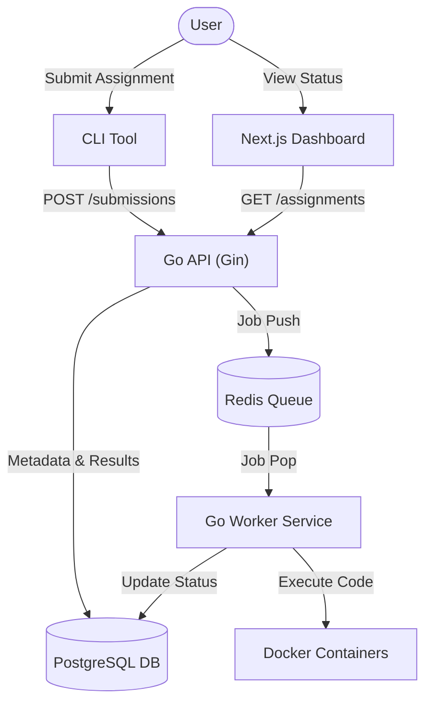

# pesu-cli

An official portal and command-line tool for students and teachers to manage, submit, and automatically evaluate coding assignments in a secure, containerized environment.

## Architecture

The system is composed of several decoupled components interacting via a central API and a task queue.



## Key Features

- **Decoupled Architecture**: Uses Redis for asynchronous processing, ensuring high availability and responsiveness.
- **Secure Sandboxing**: Evaluates student code in isolated Docker containers with strict resource limits (CPU, Memory) and no network access.
- **Ephemeral Processing**: Code bundles are processed in-memory and never stored persistently, minimizing security risks.
- **Multi-Language Support**: Initial version supports **Python** and **C** evaluation.
- **Seamless Auth**: JWT-based authentication for both CLI and Dashboard.

## Components

### [Backend API](./api)
- Built with **Go** and the **Gin** framework.
- Manages users, assignments, and submission metadata.
- Orchestrates job queueing via Redis.

### [CLI Tool](./cli)
- Built with **Cobra**.
- Handles zipping of student directories and authenticated submission.
- Store tokens locally for persistent sessions.

### [Worker Service](./worker)
- A specialized Go service that consumes jobs from Redis.
- Manages Docker container lifecycles for code evaluation.

### [Dashboard](./dashboard)
- **Next.js** web application for students and teachers.
- Teachers can perform CRUD operations on assignments.
- Students can track their submission status and read task descriptions.

---

## Getting Started

### Prerequisites
- Docker & Docker Compose
- Go 1.24+ (for local development)
- Node.js & npm/bun/pnpm (for the dashboard)

### 1. Start the Backend Infrastructure
Spin up the database, queue, API, and worker using Docker Compose:

```bash
docker-compose up --build
```

### 2. Build the CLI
```bash
cd cli
go build -o pesu
./pesu login
./pesu submit -a <assignment_id> -p <path_to_code>
```

### 3. Run the Dashboard
```bash
cd dashboard
npm install
npm run dev
```

---

## Current Progress

- **Infrastructure & Backend Integration**: The backend API works concurrently with PostgreSQL and Redis via Docker Compose.
- **Worker Evaluation Model**: The Go worker daemon correctly listens to the Redis queue, executing submissions via Docker containers based on limited resources.
- **CLI Implementation**: The Cobra CLI cleanly implements `login` and `submit` functionality covering basic authentication state and file bundling for submissions.
- **Dashboard Interface Revamp**: The Next.js frontend has been completed for the **Student** view with cleanly designed, humane, and professional Landing (`/`), Login (`/login`), and Assignments (`/assignments`) dash interface that interfaces with the API.

---

## Scope for Improvement

- **Missing Teacher Portal**: While the base schema exists, the frontend inherently lacks routes and UI necessary for creating, updating, or deleting assignments (the Teacher workflow).
- **Environment Management**: Key credentials (like the JWT Secret, Postgres password) are hardcoded in the Go API and `docker-compose.yml`. They need to be securely loaded via `.env`.
- **Worker Resource Validation**: Verify and extend the `processor.Execute()` parameters to strictly ensure network isolation (`--network none`) and CPU/memory capping.
- **Git Hygiene cleanup**: The local Go binaries compiled from the CLI module (`pesu` and `pesu-cli`) should be ignored from version control to prevent repository bloating.
- **Automated Testing Suite**: Introduce unit tests inside `api`, `cli`, and `worker` directories using standard Go testing tools.
- **Improved CLI Feedback Loop**: Add loaders to CLI processes, and allow the student to query specific assignment status without relying on the Next.js visual dashboard.

---

## What's Next

1. **Build the Teacher UI**: Create frontend pages/modals to allow authenticated instructors to post and manage coding challenges.
2. **Move Configurations to `.env`**: Remove all hardcoded credentials from YAML config files and source code.
3. **Deepen the Assignment Dashboard**: Add a detail page in the dashboard (`/assignments/[id]`) to view constraints, prompt bodies, and the code outputs/scores of past student submissions.

---

## License
This project is licensed under the [MIT License](./LICENSE).
